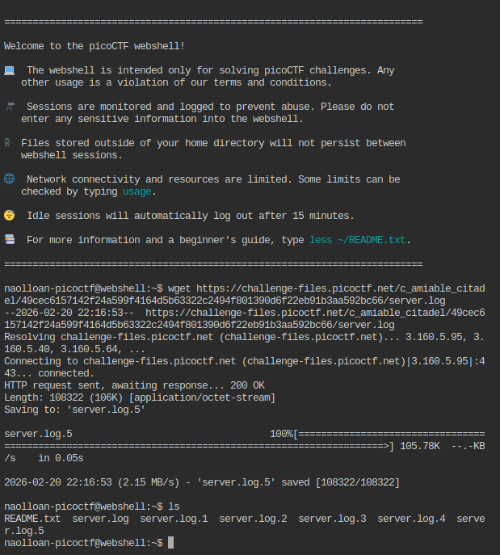
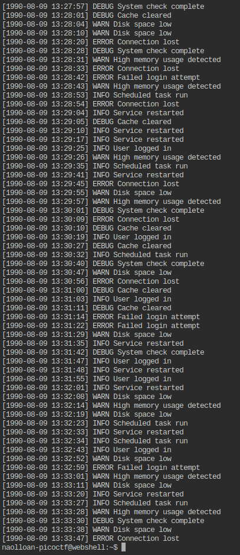
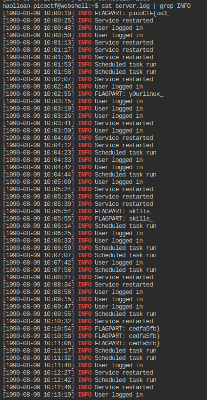

## Challenge Information

> Author: Yahaya Meddy

> Category: General Skills

> Difficulty: Easy

> Challenge Name: Log Hunt

> Description: Our server seems to be leaking pieces of a secret flag in its [logs](https://challenge-files.picoctf.net/c_amiable_citadel/49cec6157142f24a599f4164d5b63322c2494f801390d6f22eb91b3aa592bc66/server.log). The parts are scattered and sometimes repeated. Can you reconstruct the original flag? Download the logs and figure out the full flag from the fragments.

> Challenge Link: https://play.picoctf.org/practice/challenge/527

> Hints: 1. You can use `grep` to filter only matching lines from the log.
         2. Some lines are duplicates; ignore extra occurrences.

## Steps

> First you need to copy the logs from the [link](https://challenge-files.picoctf.net/c_amiable_citadel/49cec6157142f24a599f4164d5b63322c2494f801390d6f22eb91b3aa592bc66/server.log) provided in the problem statement and after that we need to find and organize the flags from the contents of the logs.

> Having copied the link to the logs, we need to go to our shell and organize our logs and proceed to find our flag. You can use your own shell or pico's shell. I will be using Pico's provided shell.

> Now we will download the logs file using `wget` command. After downloading you can find a server.log file in the home folder.

 

> After downloading the file, now it is time to display its contents since the flag is inside it. You can use the `cat` command for this.

```cat server.log```



> When you display the whole content of the log, you will see many logs which makes it hard to find the flag directly. But if you look closely the word INFO is repeated many times. Use the following command to filter logs corresponding to INFO.

```cat server.log | grep INFO```



> And walaa! you can see that in the first line there is mention of FLAGPART. So we can use this information and try to display the contents only corresponding to the FLAGPART logs.

```cat server.log | grep FLAGPART```


> Now we only see the flag fragments. And all we got to do is combine all the fragments in the correct order.

The extracted parts are:
`
picoCTF{us3_`
`y0urlinux_`
`sk1lls_`
`cedfa5fb}  
`
## Final Flag

```picoCTF{us3_y0urlinux_sk1lls_cedfa5fb}```
